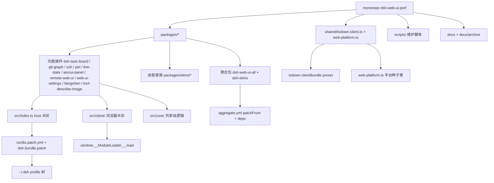

# Project Overview

## 重构方向（一句话）

以「统一构建契约 + 消除跨插件重复 + 收敛轮询/渲染热点 + 补全类型缺口」为主轴，在保持 cordis.patch.yml + profile 挂载（不改 DSH 源码）前提下，把 12 个功能/聚合插件与皮肤家族拉到同一性能与可维护性基线。

## 当前架构



## 技术栈

| 维度 | 选型 | 证据 |
| --- | --- | --- |
| 语言/运行时 | TypeScript, node ^22.19 or >=24, ESM "type":"module" | packages/AGENTS.md:9 |
| 包管理 | pnpm (workspace packages/* + packages/skins/*) | pnpm-workspace.yaml:1-3 |
| UI 框架 | React (peer) + CSS Modules (lightningcss) | packages/AGENTS.md:28-29 |
| 构建 | tsdown + shared/tsdown.client.ts 唯一预设 | shared/tsdown.client.ts:1 |
| 浏览器加载 | closure-factory bundle + __ModuleLoader__ + 模块表 externals | shared/tsdown.client.ts:3-6 |
| 测试 | vitest per-package（无 workspace 配置，各包独立 config） | 各包 vitest.config.ts |
| CI | GitHub Actions, typecheck/build/test/docs + emoji 门 | .github/workflows/ci.yml |

## 入口点

- 每个功能插件 host 半区：`src/index.ts`（cordis 插件 apply + systemPrompt section + settings），如 packages/dsh-task-board/src/index.ts:1。
- 浏览器半区：`src/client/index.ts`，经 `exports["./client"]` -> lib/client.js 注入；dsh.client 声明 inject 依赖、platform:"web"，如 packages/dsh-task-board/package.json dsh 字段（task-board cordis.patch.yml:1-10）。
- cordis.patch.yml 形态：单 insert 行, id + name（包名），如 packages/dsh-git-graph/cordis.patch.yml:1-10。
- 聚合包：packages/dsh-web-ui-all/aggregate.yml 声明 patchFrom / self / deps（web-ui-all/aggregate.yml:1-33）；dsh-skins/build.mjs 把皮肤资产收进聚合包（dsh-skins/build.mjs:7-22）。

## 构建与验证命令

```text
pnpm build              pnpm -r build（全仓构建）
pnpm test               pnpm -r test（全仓 vitest run）
pnpm typecheck          pnpm -r typecheck
pnpm test:scripts       node --test scripts/*.test.mjs
pnpm aggregate:check    node scripts/aggregate.mjs --check（聚合包一致性）
pnpm gallery:check      node scripts/gallery-build --check（画廊一致性）
pnpm skin-center:check  node scripts/skin-center-bundles --check（皮肤中心一致性）
pnpm community:check    node scripts/community-index --check（社区索引一致性）
pnpm runtime-deps:check node scripts/runtime-deps-check.mjs（lib/ 裸导入门）
pnpm docs:check         node scripts/verify-docs.mjs（链接/i18n/预算门）
pnpm docs:write-pair    verify-docs.mjs --write（重录 i18n hash）
pnpm gallery:build / gallery:capture / deploy:gallery   画廊构建/截图/部署
pnpm skin:new           node scripts/dsh-skin-new（皮肤脚手架）
pnpm pr:review          node scripts/pr-review.mjs
```
（脚本均来自 root package.json scripts）

- shared/tsdown.client.ts 提供 clientBundle()：node-half lib + browser lib/client.js；external 取自 web-platform.ts 平台种子表 + 一个文档化 runtime 豁免（RUNTIME_STORE_EXEMPTION），见 shared/tsdown.client.ts:62-101。
- web-platform.ts 纯度门：浏览器 bundle 对 @deepseek-ai/* 只允许 type-only 或平台种子表值导入，跨插件协作走 cordis 服务，shared/web-platform.ts:1-15, shared/tsdown.client.ts:144-158。
- DSH_BUILD_FACE=host/client 决定 face；host-only 包跳过浏览器 face，shared/tsdown.client.ts:135-150。
- 全仓库 22 个 tsdown 配置全部 import shared/tsdown.client.ts（无包内复制），扫描确认 0 例外。

## 测试基线

- 无根 vitest workspace；每包自带 vitest.config.ts，include 样式不一（task-board: tests/**，pet: src/**/*.test + tests/**）。
- 各包测试框架：vitest run；极少数用 node:test（scripts/*.test.mjs 走 pnpm test:scripts）。
- 测试文件规模（排除 node_modules/lib）：dsh-aionui-panel 14，dsh-remote-web-ui 10 (tests/)+5 (src/mobile)，dsh-task-board 9，dsh-pet 6，dsh-tool-describe-image 6，dsh-git-graph 5，dsh-live-stats 5，dsh-ssh 5，dsh-liangshen 4，dsh-web-ui-settings 4，skin-center 4，其余 9 皮肤各 1-2；聚合包 dsh-web-ui-all / dsh-skins 无单测（有 --check 生成门）。
- 仓库 git 跟踪文件 886 个；TS/TSX 源文件 378 个；功能插件 src 直接行数合计约 4.2 万行。

## 项目治理基线

- 三层 AGENTS.md：根 AGENTS.md（布局/命令/全局规则）、packages/AGENTS.md（bundle 形态/SDK/纯度门/测试纪律）、docs/AGENTS.md（文档分层/i18n/预算）。
- 包级 AGENTS.md 9 份：dsh-git-graph、dsh-remote-web-ui、dsh-skins、dsh-ssh、dsh-task-board、dsh-web-ui-all 及 scripts/plugin-template（模板）。
- 文档分层：docs/ 只放长期文档（plugins/i18n/development/publish-prep）；一次性记录进 docs/archive/（现有 2 份 task-handoff）。
- 预算门：scripts/doc-budgets.manifest.json 设 6 项词数上限（AGENTS.md 1400 / packages 900 / docs/AGENTS 1200 / plugins 2300 / i18n 900 / development 900）；docs:check 强制执行。

## 外部集成

- NPM SDK：类型与运行时仅来自 @deepseek-ai/*（cordis/connection/locale/runtime/slots/settings/system-prompt/host-webserver/llm/session/workspace/subprocess 等），node_modules 解析；peer 声明运行时注入服务。
- git：dsh-git-graph 与 dsh-aionui-panel 通过 host 半区调 @deepseek-ai/dsh-subprocess 执行真实 git（status/log/switch/commit/stage/discard）。
- ssh：dsh-ssh 用 ssh2 + ws + @xterm，持久连接池、隧道、集群执行，配置存 ~/.dsh/dsh-ssh.json。
- 文件系统：dsh-aionui-panel host 半区经 @deepseek-ai/dsh-host-webserver + dsh-subprocess 提供 fs/git 服务；task-board 用浏览器 localStorage（键 dsh.taskBoard.v1）。
- 浏览器 API：window.__ModuleLoader__（bundle 加载）、document/DOM 挂载（sidebar/center-column）、Cloudflared（remote-web-ui 隧道）、cookie/localStorage、visibilitychange（调度恢复）。
- 远程控制：remote-web-ui 用 cloudflared 自带 tunnel 客户端 + 一次性配对 token + mobile bundle（mobileBundle() 完全自包含，shared/tsdown.client.ts:153-220）。

## 关键事实与数字

- 功能插件 10 个 + 聚合包 2 个（web-ui-all / dsh-skins）+ 皮肤族 10 个（含 skin-center 宿主）共 22 个包，全部 workspace。
- 依赖关系：web-ui-all dependencies 引用全部功能插件 + dsh-skins + skin-center（workspace:*）；dsh-skins 仅依赖 dsh-client-ui-skin-center；功能插件彼此无值依赖（跨插件协作走 cordis slots/services）。
- 构建契约：0 个包内复制 tsdown 预设；22 个 tsdown.config 全走 shared/tsdown.client.ts。
- 源码量：功能插件 src 合计约 4.3 万行（aionui 8.9k / remote-web-ui 10.2k 为最大两包）；git 跟踪全文件 886 个、TS 378 个。

## S.U.P.E.R 10 项检查清单

| 检查 | 判定 | 证据/说明 |
| --- | --- | --- |
| 每 module 单一职责 | partial | host/client/core 三区拆分清晰(packages/AGENTS.md:12-15)，但 remote-web-ui 单包 src 达 10.2k 行、同时含 host/mobile/更新链路，职责偏多 |
| 函数单一职责 | pass | 未发现明显超长混合函数 |
| 单向数据流 | partial | core 纯逻辑框架清晰(task-board core/controller)，但 client 直接读 localStorage(task-board client apply) 且多数包无显式数据流分层 |
| 无循环导入 | pass | 构建/类型检查门禁约束，未发现循环 |
| 跨模块接口 schema 化 | partial | schemastery schema 用于 Config(如 task-board index.ts Config)；但 ssh/remote-web-ui 的 wire protocol(protocol.ts/routes.ts) 未见统一 schema 声明 |
| 模块 I/O 可序列化 | pass | cordis slots/settings 均走结构数据；remote mobile 走 fetch/WebSocket JSON |
| 无硬编码 | partial | TASK_BOARD_GUIDANCE 大段中日文案内联于 index.ts(内含路径 ~/.dsh/...)；部分轮询间隔/阈值散落各包 |
| 依赖显式声明 | pass | dependencies/peerDependencies 声明完整，且有 runtime-deps-check 门禁 |
| 可替换性 | partial | 聚合包 patch 机制使插件可热插拔(replaceable)；但 aionui/remote 两包内部耦合 fs/git/subprocess 与 host-webserver 较紧 |
| 全测试通过后收尾 | pass | CI 全量跑 typecheck/test/docs，改动前必须通过 |

## 给重构任务的 TOP 建议清单

- dsh-aionui-panel：1) 把 fs/git host 服务从 host-webserver+subprocess 改为声明式 schemastery Schema 服务，收敛 wire 接口；2) 降低 setInterval/poll 轮询数量，统一为节流+watch 复用；3) 拆分 8.9k 行 src 为 host/client/core 三区子模块清单；4) 为 clamp/pure 之外补齐端口式接口测试。
- dsh-remote-web-ui：1) 统一 mobile/desktop wire protocol 到单一 zod schema；2) 抽出隧道/配对/更新为独立可替换 service（当前 10.2k 行过重）；3) 收敛多套 mobile *.test 进 tests/ 统一 include；4) 对 cloudflared 隧道建立显式生命周期与错误恢复测试。
- dsh-task-board：1) 把 TASK_BOARD_GUIDANCE 文案移到 i18n locale，去掉硬编码路径；2) 调度器增加最大并发/错误重试上限，避免浏览器端堆栈；3) 统一 localStorage 键与存储 schema 版本化；4) 合并 apply-guard 与 DOM 挂载守卫的重复逻辑。
- dsh-git-graph：1) 把 git poll 统一 deadline+backoff（现有 poll deadline 已修，需抽成共享 util）；2) 补全 types.ts 到 zod/io-ts 运行时校验；3) 分支切换与 status 刷新合成一个原子请求，减少往返；4) invariant.ts 与 client 断言合并。
- dsh-ssh：1) routing/tools/protocol 三层 wire schema 统一；2) 连接池空闲/重连策略抽成可测 engine 接口（engine.ts 已存在，需类型化池状态）；3) exec 非幂等重放过期警告写入 README 安全模型；4) 密钥/passphrase 加载路径集中到单一 store.ts。
- dsh-live-stats：1) 抽公共 throttle/节流 hook 避免 TpsLine 独立计时器；2) estimator/projection 纯函数化并做金本位快照测试；3) dsh-token-meter 订阅改为 selector 粒度减少重渲染；4) 补 settings-form 与兼容 scope 的类型导出。
- dsh-web-ui-settings：1) bridge/allowlist/protocol 收敛成单一声明式插件组 schema；2) compat-settings-scope 与官方 settingsScope 的 fallback 逻辑抽共享 helper；3) 统一 generated 目录来源，避免手写码漂移；4) 把 allowlist 常量表迁移到 docs 或 i18n 数据源。
- dsh-pet：1) 动画/空闲轮询统一到单一 requestAnimationFrame 循环，勿叠加 setInterval；2) affinity/persist/src 内嵌的 *.test 移到 tests/ 统一 include；3) spritesheet 加载缓存为模块单例，避免重复 fetch；4) 状态机(thinking/waiting/tool/done)补显式 transition 表测试。
- dsh-liangshen：1) 两阶段 elevation 的状态机抽为纯 reducer 并补边界测试；2) preset 文件写入 ~/.dsh/.agent-presets 的路径/原子写集中到 sync.ts 单一模块；3) 把 parse/fallback 判定阈值参数化进 Config；4) 与 minimal 锚定的对比逻辑抽成可单测策略。
- dsh-tool-describe-image：1) 把 vision endpoint 调用抽成 HTTP service(可注入 mock)，当前 send-hook/loader 依赖太杂；2) 统一 attach/send 的 note 序列化契约到 zod；3) 错误/超时文案进 i18n，避免硬编码；4) 抽 mock-server 到测试共享 fixture。
- dsh-skins / skin-center：1) build.mjs 与 skin-center 的 registry 生成共用同一 manifest 源，避免双份清单漂移；2) 皮肤 apply/dispose 契约补统一 smoke 测试模板；3) try-on 资源预加载/卸载做防泄漏(统一 dispose)；4) skin-switch 互斥状态抽纯 reducer。
- dsh-web-ui-all：1) compat shim 的 MutationObserver 轮询改为一处集中订阅，避免重复扫描；2) 保持 aggregate 无单测但为 aggregate.mjs 的 check 模式补 end-to-end 断言；3) dependencies 清单与 aggregate.yml 用脚本派生，消除手写漂移（已用 aggregate.mjs 生成，需补 validator）；4) 把 self compat 与 function 插件边界写进 README 架构节。
