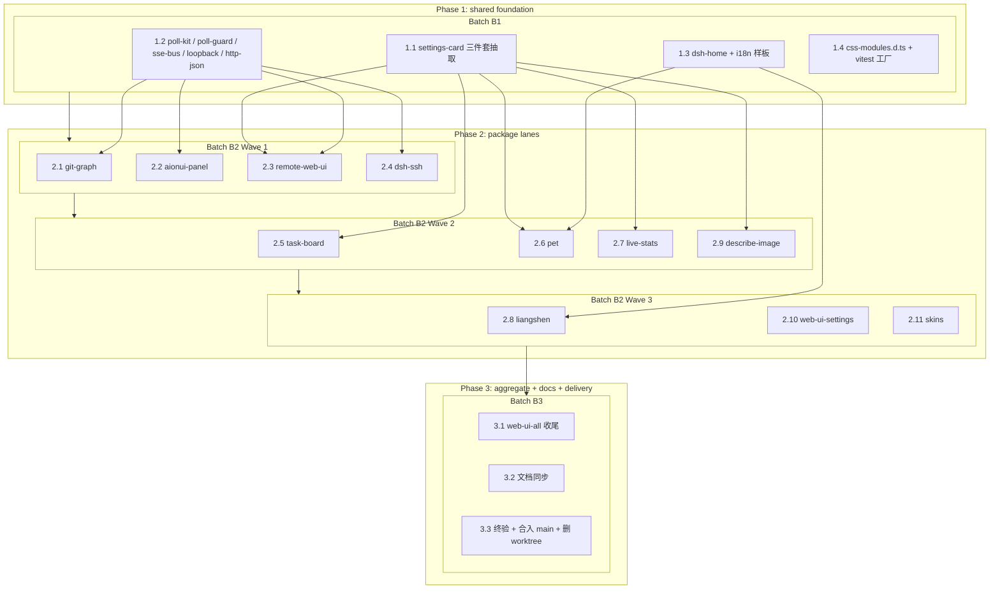

# Task Dependency Graph

```mermaid
graph TD
    subgraph P1 [Phase 1: shared foundation]
        subgraph B1 [Batch B1]
            T1_1[1.1 settings-card 三件套抽取]
            T1_2[1.2 poll-kit / poll-guard / sse-bus / loopback / http-json]
            T1_3[1.3 dsh-home + i18n 样板]
            T1_4[1.4 css-modules.d.ts + vitest 工厂]
        end
    end
    subgraph P2 [Phase 2: package lanes]
        subgraph B2W1 [Batch B2 Wave 1]
            T2_1[2.1 git-graph]
            T2_2[2.2 aionui-panel]
            T2_3[2.3 remote-web-ui]
            T2_4[2.4 dsh-ssh]
        end
        subgraph B2W2 [Batch B2 Wave 2]
            T2_5[2.5 task-board]
            T2_6[2.6 pet]
            T2_7[2.7 live-stats]
            T2_9[2.9 describe-image]
        end
        subgraph B2W3 [Batch B2 Wave 3]
            T2_8[2.8 liangshen]
            T2_10[2.10 web-ui-settings]
            T2_11[2.11 skins]
        end
    end
    subgraph P3 [Phase 3: aggregate + docs + delivery]
        subgraph B3 [Batch B3]
            T3_1[3.1 web-ui-all 收尾]
            T3_2[3.2 文档同步]
            T3_3[3.3 终验 + 合入 main + 删 worktree]
        end
    end
    T1_2 --> T2_1
    T1_2 --> T2_2
    T1_2 --> T2_3
    T1_2 --> T2_4
    T1_1 --> T2_3
    T1_3 --> T2_6
    T1_3 --> T2_8
    T1_1 --> T2_5
    T1_1 --> T2_6
    T1_1 --> T2_7
    T1_1 --> T2_9
    B1 --> B2W1
    B2W1 --> B2W2
    B2W2 --> B2W3
    B2W3 --> B3
```

- B1 内部 1.1-1.4 相互独立（shared 新文件互不重叠，可顺序提交）。
- B2 三波按 lane 负载编排；波内 lane 文件集互不相交，可并行。
- B3 依赖 B2 全部完成。
